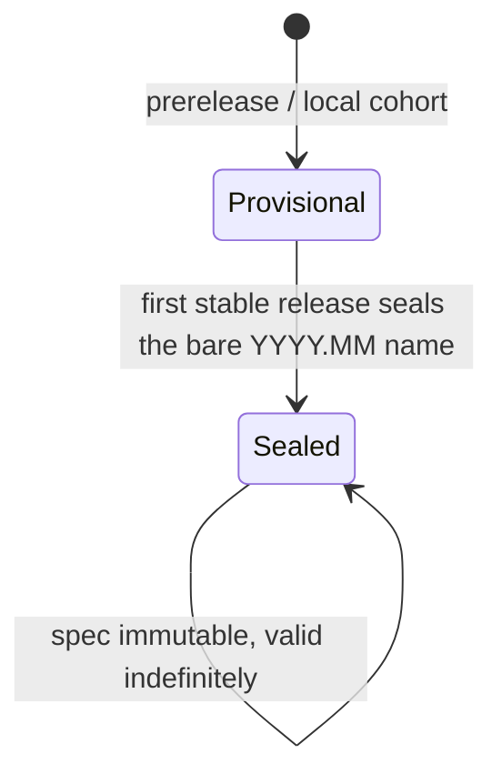

# Workflow Editions

A workflow edition is a named behavioral contract for RLMesh workflow semantics. The base edition (`YYYY.MM`) identifies one spec document in this section; prerelease and local builds offer a cohort suffix so moving builds fail closed unless both sides are from the same cohort. Exactly one edition governs a session, reconciled by the runtime after the handshake.

> [!NOTE]
> The bare `2026.06` edition sealed at 0.1.0. Prerelease and local builds use exact cohort suffixes (for example `2026.06-dev.<git>`) so moving builds fail closed rather than guess they are compatible.

Editions answer a different question than the protocol generation. The protocol generation (`rlmesh-wire-v1`) names the wire shape: which services, messages, and fields exist. The edition names what a conforming interaction over that shape _means_: lifecycle, ordering, episode accounting, and error semantics.

## Negotiation

The client **declares** every edition it can operate under in `HandshakeRequest.supported_workflow_editions`, and the one it wants in `preferred_workflow_edition`; the server replies with its own supported set in `HandshakeResponse.supported_workflow_editions` and its own declaration in `preferred_workflow_edition` (see [Declaring an Edition](#declaring-an-edition)). A peer that declares nothing is read as wanting the newest edition it supports, which is what every build made before the field existed means. A declaration is a ceiling, and its shape says what kind: a bare `YYYY.MM` base is a base-level ceiling that admits every cohort of that base (and anything older), so `2026.06` selects a dev build's `2026.06-dev.<git>` when that is what both sides offer; a declaration with a cohort suffix uses the full edition ordering as its ceiling. CAN membership still requires an exact spelling: differing provisional cohorts interoperate only through a sealed fallback both sides advertise. The handshake decides only protocol-generation compatibility; it selects no edition, and there is no `HandshakeResponse.selected_workflow_edition` field. The runtime is the sole edition authority because only it sees every participant: after the handshake it takes the floor across env, model, and runtime (`negotiate_session_floor`, reached through `env_floor`) and pins that edition on `ResolveAdapterRequest.selected_workflow_edition` and on `ConfigureEnvRequest.selected_workflow_edition`, the env's first Join message (an env must still accept a session that opens with `Reset`: a runtime built before the pin existed sends none). A matching suffixed cohort wins over its sealed fallback; if prerelease cohorts differ, peers can only interoperate through a sealed edition that both sides explicitly advertise. The runtime reads every edition-governed default from a per-edition table keyed by the selected edition and refuses a name it has no row for; the table has one row today (see [compatibility](../compatibility.md) for what that does and does not yet prove).

- An empty intersection does not set `compatible = false`, which reflects protocol generation alone: such a peer handshakes successfully and the session then fails at the runtime's floor, with a diagnostic naming what each tier (env, model, runtime) offered. The response lists the server's supported editions for that diagnostic, but there is no second round trip because the client's offer was already complete.
- Servers accept only editions they explicitly support. A server never accepts an unknown edition on the assumption that it is probably compatible; forward compatibility lives in the client's offer set, not in server leniency.

## Declaring an Edition

An edition is a **sticky declaration**: you write down the edition you authored against, and upgrading the rlmesh package never changes how your env or model behaves. It is the same idea as NixOS's `system.stateVersion`. Declare it once, in source, and leave it there until you deliberately move it.

Paste the value `rlmesh.current_workflow_edition()` reports on the build you are authoring against: the bare base (`2026.06`), on every build of that edition. It names the contract, not a particular build of it, so it selects whichever spelling both sides offer — the sealed name on a release, the build's own cohort (`2026.06-dev.<git>`, what `rlmesh.build_info().workflow_edition` reports) on a prerelease or source build. A cohort spelling is also accepted when its ceiling admits an edition this build offers. It can select a shared sealed fallback; it does not promise to reproduce an arbitrary prerelease build. Use the bare base for a durable declaration.

```python
import rlmesh


class MyEnv(rlmesh.EnvFactory):
    # What rlmesh.current_workflow_edition() printed on the build you
    # authored against. Leave it here until you deliberately move it.
    workflow_edition = "2026.06"

    def make(self): ...
```

Every participant declares independently. The highest declaration that all of them can run is the session's edition; when no such edition exists the session is refused before any episode starts, with a message naming what each tier (env, model, runtime) wants and can do.

### Precedence

Highest first. The two sticky homes are the ones that travel with your source.

| Surface                                                       | Scope           | Sticky?                               |
| ------------------------------------------------------------- | --------------- | ------------------------------------- |
| `run(workflow_edition=...)` / `session(workflow_edition=...)` | one call        | no                                    |
| `RLMESH_WORKFLOW_EDITION`                                     | one process     | no — a deployment override            |
| `ServeOptions(workflow_edition=...)` / `--workflow-edition`   | one served peer | no                                    |
| `EnvFactory.workflow_edition` / `Model.workflow_edition`      | the class       | **yes — source-resident**             |
| `[tool.rlmesh] workflow_edition` in `pyproject.toml`          | the project     | **yes — project-resident**            |
| nothing declared                                              | —               | floats to this build's newest edition |

A value this build cannot run a session at is refused where you typed it, naming the value and the editions this build offers. Accepted are the bare base of every edition the build retains (`rlmesh.current_workflow_edition()` and any older sealed edition), plus any cohort spelling that admits one of its offers. Anything else — a base no release implements, or a stale prerelease cohort that sorts below everything this build offers — raises there and then.

Declaring nothing is allowed. A participant with a home for the declaration -- an authored `EnvFactory`/`Model` subclass, or anything served -- warns once per process (`rlmesh.WorkflowEditionWarning`), naming the edition it floated to: an undeclared peer's behavior follows whatever rlmesh you happen to have installed. An ad hoc callable in a local `run`/`session` floats quietly. Set `RLMESH_WORKFLOW_EDITION` to an empty string to float deliberately: resolution stops at that rung -- no class or project declaration below it is consulted -- and the warning stays quiet. That is what this repository's own test suites do, since they exercise whatever they were built from rather than a sealed contract.

## Edition vs. Capability vs. Bug Fix

Most development never touches the edition:

- A change to the meaning of an existing, conforming interaction mints a new edition. This is rare, and breaking semantic changes batch into at most one new edition per release.
- A new addition that is ignorable or detectable, such as a new RPC, a new field, or an opt-in behavior, is a capability or a plain feature. No edition.
- An implementation that deviates from the governing spec document has a bug. Fixing it needs no edition.

## Lifecycle: Provisional, Then Sealed

An edition is **provisional** while no stable release has shipped it: prerelease builds use exact release-cohort names (`YYYY.MM-X.Y.Z-beta.N`), and local source builds use exact `dev.<git>` cohort names. This prevents accidental interoperability between moving builds that have not had stable-release scrutiny. The first stable release that ships an edition **seals** the bare `YYYY.MM` name permanently: the spec document becomes immutable (enforced by checksum), and any later semantic change mints a new edition.



`2026.06` used provisional cohorts through the 0.1 prerelease series and sealed at v0.1.0. After sealing, it remains valid indefinitely; a new edition is minted only by a deliberate semantic redesign, never on a schedule.

## Support Window

Sealing freezes an edition's spec by checksum. Every later release keeps offering and accepting a sealed edition, including betas for a later edition, and sealed editions are never pruned: `rlmesh.toml` is the retained list, the crates generate their offer from it, and `mise run policy:check` fails if a sealed edition leaves it or if the list lost an edition the last release tag had sealed. The wire-v1 and sealed-edition commitments apply from v0.1.0; broader API stabilization remains on the roadmap (see [compatibility](../compatibility.md)). A provisional cohort, which no stable release has sealed, may change or be dropped and interoperates only with the same cohort unless both sides implement and advertise a sealed fallback.

## Enforcement

`rlmesh.toml` records the base edition, current official release cohort, supported editions, and each edition's `status` (`provisional` or `sealed`) plus `spec` path. A sealed edition also records `sealed_in` and `spec_sha256`. `scripts/check_rlmesh_policy.py` verifies sealed spec checksums, rejects provisional editions in stable releases, and checks that prerelease cohorts match the workspace SemVer. Local dev cohorts are generated at build time and are not committed to the manifest.

### Additive-forever rules

`rlmesh-wire-v1` only grows, and `policy:check` pins the shapes an older peer cannot absorb silently. The `[wire]` table in `rlmesh.toml` records the gRPC message cap (`max_message_bytes`, 256 MiB, equal to `rlmesh_grpc::MAX_MESSAGE_SIZE`), the value count of every proto enum (`[wire.enums]`), and the arm count of the `MetaValue.kind` and `SpaceSpec.spec` oneofs (`[wire.oneofs]`). The check fails when the live protos or the constant differ from the manifest, so a new enum value, a new oneof arm, or a different cap lands only with a deliberate manifest edit in the same change. The retention rule also compares against the previous release tag: no edition that tag sealed may leave `supported_editions`.

The manifest edit is the paperwork; the house rule is on the emitter. A peer built before a value existed does not refuse every new shape cleanly: an unknown `DataType`, `AutoresetMode`, or `SpaceSpec` arm is a decode error, but an unknown `EnvErrorCode` or `ModelErrorCode` folds to `UNSPECIFIED`, and an unknown `MetaValue.kind` arm reads as `null`. So a new enum value, dtype, or oneof arm is emitted only when the target leg's edition (or an advertised capability) covers it; to any other peer the runtime refuses cleanly or converts, and never forwards the new shape. The two error-code vocabularies are frozen for wire-v1: error semantics never ride a new code.

## Editions

- [2026.06](2026.06.md) (sealed at 0.1.0)
